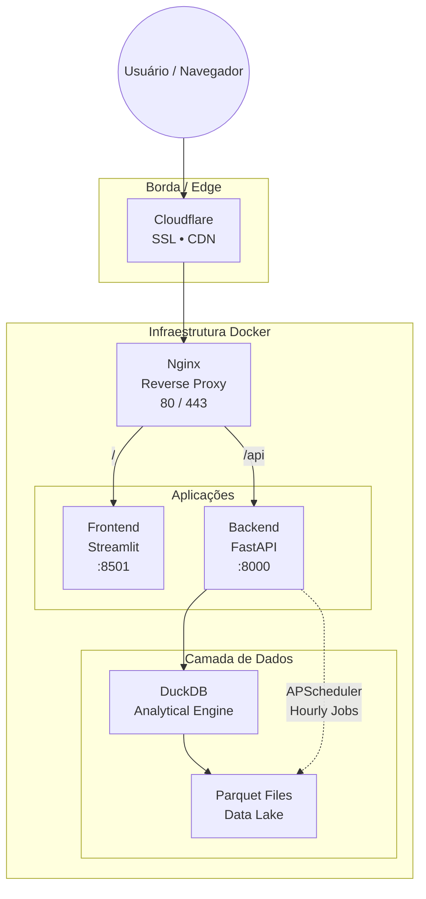

# 🛒 Preços PMC — Plataforma de Comparação de Preços


Plataforma **full-stack** para comparação de preços entre diferentes estabelecimentos, com **atualização automática de dados**, backend em **FastAPI**, frontend em **Streamlit** e **DuckDB** como motor analítico de alta performance.

O projeto foi desenhado para ser **simples de operar**, **eficiente em consultas analíticas** e **fácil de implantar em produção** via Docker.

---

## 📌 Sumário

* [Arquitetura](#-arquitetura)
* [Principais Funcionalidades](#-principais-funcionalidades)
* [Stack Tecnológica](#-stack-tecnológica)
* [Como Executar](#-como-executar)
* [Desenvolvimento](#-desenvolvimento)
* [Atualização de Dados](#-atualização-de-dados)
* [Documentação da API](#-documentação-da-api)
* [Estrutura do Projeto](#-estrutura-do-projeto)
* [Configurações](#-configurações)
* [Testes](#-testes)
* [Licença](#-licença)
* [Contribuição](#-contribuição)
* [Suporte](#-suporte)

---
## 🏗️ Arquitetura

```
┌─────────────┐
│    Nginx    │  (Portas 80 / 443)
│ Reverse     │
│ Proxy       │
└──────┬──────┘
       │
       ├─────────────┐
       │             │
┌──────▼──────┐ ┌────▼─────────┐
│  Frontend   │ │   Backend    │
│  Streamlit  │ │   FastAPI   │
│  (8501)     │ │   (8000)    │
└─────────────┘ └──────┬──────┘
                        │
                 ┌──────▼──────┐
                 │   DuckDB    │
                 │ Data Lake   │
                 └─────────────┘
```



## ✨ Principais Funcionalidades

* Consulta analítica de preços sobre dados armazenados em Parquet
* Agregações e filtros executados diretamente no DuckDB
* Atualização incremental dos dados via scheduler
* Exposição de dados por API REST
* Frontend leve para exploração e validação dos dados


## 🛠️ Stack Tecnológica

### Backend

* **FastAPI** — Framework web moderno e performático
* **DuckDB** — Banco de dados analítico embutido
* **Polars & Pandas** — Processamento e manipulação de dados
* **APScheduler** — Agendamento de tarefas em background
* **Pydantic** — Validação de dados e configuração

### Frontend

* **Streamlit** — Interface web interativa
* **Polars** — Operações rápidas com DataFrames

### Infraestrutura

* **Docker & Docker Compose** — Containerização e orquestração
* **Nginx** — Reverse proxy e terminação SSL
* **Cloudflare** — Certificados SSL e CDN


## 🚀 Como Executar

### Pré-requisitos

* Docker
* Docker Compose
* (Opcional) Python 3.9+ para desenvolvimento local

---

### ▶️ Execução Rápida com Docker

1. **Clone o repositório**

   ```bash
   git clone <repository-url>
   cd precos-pmc-front-and-backend
   ```

2. **Configure as variáveis de ambiente**

   Crie os arquivos `.env`:

   ```bash
   # backend/.env
   # Defina aqui suas variáveis de ambiente
   ```

   ```bash
   # frontend/.env
   BACKEND_URL=http://backend:8000
   ```

3. **Suba os containers**

   ```bash
   docker-compose up -d
   ```

4. **Acesse a aplicação**

   * Frontend: `http://localhost` ou `https://localhost`
   * API Backend: `http://localhost/api`
   * Documentação da API: `http://localhost/docs`

---

### 🧑‍💻 Desenvolvimento Local

#### Backend

```bash
cd backend
pip install -r requirements.txt
uvicorn main:app --reload --port 8000
```

#### Frontend

```bash
cd frontend
pip install -r requirements.txt
streamlit run main.py
```

---

## 💻 Desenvolvimento

### Backend

Estrutura modular:

* **Endpoints**: `backend/api/v1/endpoints/`

  * `busca.py` — Busca de produtos
  * `produtos.py` — Gestão de produtos
  * `frontend.py` — Endpoints específicos para o frontend

* **Serviços**: `backend/services/`

  * `data_lake.py` — Atualização e manutenção do DuckDB

* **Schemas**: `backend/schemas/`

* **Core**: `backend/core/` (configurações e segurança)

---

### Frontend

Organização do Streamlit:

* **Pages**: `frontend/pages/`
* **Components (Parts)**: `frontend/parts/`

  * `cards.py` — Cards de produtos
  * `styles.py` — Estilos customizados
  * `image.py` — Manipulação de imagens

---

## 🔄 Atualização de Dados

* Atualizações automáticas **a cada 1 hora**
* Gerenciadas via **APScheduler**
* Dados armazenados em **Parquet** (`cache/gold_parquet/`)
* Estrutura inspirada em **Delta Lake (logs de transação)**

---

## 📚 Documentação da API

Disponível automaticamente após iniciar o backend:

* **Swagger UI**: `/docs`
* **ReDoc**: `/redoc`

### Principais Endpoints

* `GET /api/v1/produtos` — Lista de produtos
* `GET /api/v1/busca` — Busca de produtos
* `GET /api/v1/empresas` — Lojas/empresas
* `GET /api/v1/precos` — Informações de preços

---

## 📁 Estrutura do Projeto

```
precos-pmc-front-and-backend/
├── backend/
│   ├── api/
│   ├── cache/
│   │   └── gold_parquet/
│   ├── core/
│   ├── schemas/
│   ├── services/
│   ├── main.py
│   └── requirements.txt
├── frontend/
│   ├── pages/
│   ├── parts/
│   ├── src/
│   ├── main.py
│   └── requirements.txt
├── nginx/
│   ├── nginx.conf
│   └── Dockerfile
├── docker-compose.yml
└── README.md
```

---

## 🔧 Configurações

### Nginx

* `/api/*` → FastAPI
* Demais rotas → Streamlit
* Terminação SSL/TLS

### Certificados SSL

```text
/etc/ssl/certs/cloudflare.pem
/etc/ssl/private/cloudflare.key
```

Ou ajuste os volumes no `docker-compose.yml`.

---

## 🧪 Testes

```bash
# Backend
cd backend
pytest

# Frontend
cd frontend
pytest
```

---

## 📝 Licença

Distribuído conforme os termos do arquivo [LICENSE](LICENSE).

---

## 🤝 Contribuição

Pull Requests são bem-vindos.
Sugestões, melhorias e correções são incentivadas.

---

## 📞 Suporte

Abra uma **issue** no repositório para dúvidas ou problemas.

---

**Desenvolvido com FastAPI, Streamlit e DuckDB** 🚀
